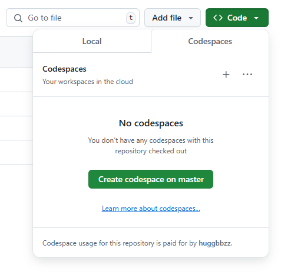
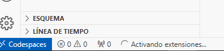

# Data Pipeline para Procesamiento de  archivos CSV en MySQL

Este proyecto implementa un **pipeline de datos** para procesar archivos **CSV** en **microbatches**, almacenarlos en **MySQL (RDS)** y calcular estadísticas en tiempo real.

## Requisitos

- **Python 3.x**
- **MySQL en AWS RDS**
- **Bibliotecas necesarias:** `pandas`, `pymysql`, `decimal`, `os`

## Ejecutar en GitHub Codespaces

Este proyecto está diseñado para ejecutarse en **GitHub Codespaces**, utilizando un contenedor de desarrollo personalizado con la carpeta `.devcontainer`.  
Dentro de esta carpeta se encuentra el archivo `devcontainer.json`, que configura el entorno de desarrollo en Codespaces.  

> 📌 **Nota:**  
> Este archivo ejecuta automáticamente la instalación de las dependencias definidas en `requirements.txt`, por lo que **no es necesario instalar ninguna librería manualmente**.

### Pasos para ejecutar el proyecto:
1. **Abre el repositorio en GitHub.**
2. **Haz clic en** `Code` (botón verde).
3. **Ve a la pestaña** `Codespaces`.
4. **Haz clic en** `+` **para crear un nuevo Codespace.**
   
   
   
5. **Espera a que el entorno se configure** (aprox. **40s** para instalar las librerías de `requirements.txt`).
   
   
   
6. **Abre `script.py` y revisa el código comentado.**

7. **Ejecuta el script en la terminal de Codespaces:**
   ```sh
   python3 script.py
